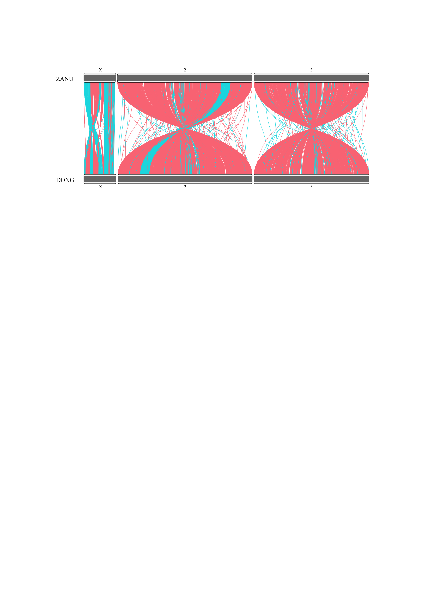

```{r}
library(RIdeogram)
library(dplyr)
```

```{r}
gene_mapping <- read.csv('gene_mapping.tsv', sep='\t')
dong_genes <- read.csv('dongola_genes.tsv', sep='\t')
zanu_genes <- read.csv('ZANU_genes.tsv', sep='\t')
```


# Clean and merge data

```{r}
head(gene_mapping)
```

```{r}
gene_mapping_clean <- gene_mapping %>%
  tidyr::separate(
    col = DONG,
    into = c(
      "dong_ncbi_id",
      "dong_middle",
      "dong_strand",
      "dong_length",
      "dong_name"
    ),
    sep=",",
    convert = TRUE
  ) %>%
  rename(
    zanu_name = name,
    zanu_strand = strand,
    zanu_middle = middle.position,
    ref_genes = ref.genes
  ) %>%
  # Map NCBI ids to chromosome names
  mutate(
    dong_contig = recode(
      dong_ncbi_id,
      `NC_053519.1` = "X",
      `NC_053517.1` = "2",
      `NC_053518.1` = "3",
    ),
    dong_name = stringr::str_remove(dong_name, "DONG_")
  ) %>%
  # Keep only required contigs
  filter(
    contig %in% c("X", "2", "3") &
      dong_contig == contig
  ) %>%
  select(
    contig,
    zanu_name,
    zanu_strand,
    dong_name,
    dong_strand,
    zanu_middle,
    dong_middle,
    ref_genes
  )

head(gene_mapping_clean)
```


# Keep closest of multimapped genes
```{r}
print(sum(duplicated(gene_mapping_clean$zanu_name)))
print(sum(duplicated(gene_mapping_clean$dong_name)))
```

```{r}
gene_mapping_dedup <- gene_mapping_clean %>%
  mutate(distance = abs(zanu_middle - dong_middle)) %>%
  group_by(zanu_name) %>%
  slice_min(order_by = distance) %>%
  group_by(dong_name) %>%
  slice_min(order_by = distance) %>%
  ungroup() %>%
  select(-distance)
head(gene_mapping_dedup)
```

No duplicates left:
```{r}
print(sum(duplicated(gene_mapping_dedup$zanu_name)))
print(sum(duplicated(gene_mapping_dedup$dong_name)))
```

# Ideogram
## Karyotype
```{r}
dong_len_2 = 111990000L
dong_len_3 = 95710000L
dong_len_X = 26910000L
karyotype <- data.frame(
  Chr = rep(c("X", "2", "3"), 2),
  Start = rep(1L, 6),
  End = c(
    27238055L,
    114783175L,
    97973315L,
    dong_len_X,
    dong_len_2,
    dong_len_3
  ),
  fill = "777777",
  species = c(rep("ZANU", 3), rep("DONG", 3)),
  size = 12L,
  color = "000000"
)
karyotype
```

## Synteny
```{r}
synteny <- gene_mapping_dedup %>% 
  mutate(
    Species_1 = recode(contig, `X` = 1L, `2` = 2L, `3` = 3L),
    Species_2 = Species_1,
    fill = ifelse(zanu_strand == dong_strand, "00DBE4", "FC7A85")
  ) %>%
  merge(zanu_genes, by.x = "zanu_name", by.y = "ID") %>% 
  merge(dong_genes, by.x = "dong_name", by.y = "ID", suffixes = c("_zanu", "_dong")) %>%
  rename(
    zanu_start = start_zanu,
    zanu_end = end_zanu,
    dong_start = start_dong,
    dong_end = end_dong
  ) %>%
  select(
    Species_1,
    Start_1 = zanu_start,
    End_1 = zanu_end,
    Species_2,
    Start_2 = dong_start,
    End_2 = dong_end,
    fill
  )
head(synteny)
```


## Plot
```{r}
ideogram(karyotype = karyotype, synteny = synteny)
convertSVG("chromosome.svg", device="png")
```

